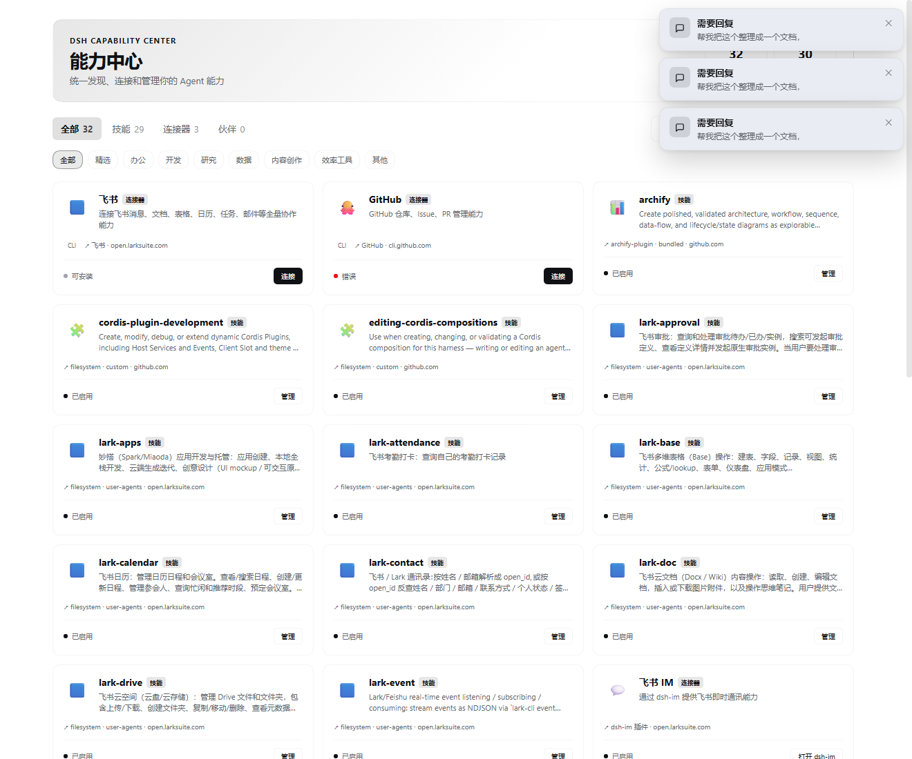

# DSH Capability Center

> [!WARNING]
> **开发中（WIP）——暂不支持安装。**
>
> 本仓库目前仅供源码阅读、设计讨论和开发预览，**不是可安装的稳定发行版，不支持生产使用**。
> 请勿将仓库代码、开发产物或示例配置接入日常使用的 DSH 环境。安装指引将在完成验收后另行提供。

DSH 的统一能力管理层（Capability Layer）探索项目，目标是为 DeepSeek Harness 提供统一的能力发现、配置、授权与状态管理入口。

## 界面预览



> 截图来自本地开发环境，仅展示当前界面设计。截图中的“安装”“连接”等操作入口及状态标签，不代表当前已支持安装、业务权限已经可用，或相关功能已完成验收。

## 当前状态

- 项目仍在开发和验证阶段，**暂不支持安装、升级或生产部署**。
- 已有 Skills / Connectors 的界面及后端实验代码；用户身份与机器人身份按不同方法进行验证。
- GitHub CLI 的只读身份验证曾在开发环境通过；这不代表仓库写入、Issue、PR 等业务权限已验收。
- 飞书用户和机器人路径仍有认证失败记录，不能宣称已完成真实接入。
- 新配方、动态候选与原页面后端尚未完成统一接线；截图不是“完整接入成功”的证明。
- 最近一次记录为 **202 项测试通过、TypeScript 类型检查通过**，但测试通过不等同于完整产品验收。

详细证据及限制：

- [同源动态只读验证记录](docs/DYNAMIC-READONLY-ACCEPTANCE.md)
- [后端开发与切换边界](docs/BACKEND-DEVELOPMENT.md)
- [飞书阶段性验证记录](docs/FEISHU-ACCEPTANCE.md)

## 设计目标（非已完成功能清单）

- **统一能力抽象**：将 Skill、MCP、CLI、API 等不同实现组织成可发现、可管理的能力。
- **复用 DSH 原生能力**：适配 Skill Runtime 和 MCP Runtime，而不是再实现一套运行时。
- **Connector 解耦**：将应用身份、接入方法和具体传输方式分开建模。
- **可复现接入**：探索应用后沉淀经过审查、带版本的 manifest / recipe，减少重复临时探索。
- **安全与身份隔离**：通过受控凭据引用、最小权限和失败关闭机制避免身份混用；仍需完整安全验收。
- **来源可追踪**：记录能力来源与版本，支持后续验证和更新。
- **松耦合扩展**：探索通过 Provider 接入 Partner 和第三方能力。

## 能力模型

```text
能力 Capability
├── 技能 Skill          — 可复用的任务指令 / 工作流
├── 连接器 Connector    — 将 Agent 与外部系统连接
│   ├── MCP
│   ├── CLI
│   ├── API
│   └── Browser        — 预留方向
└── 伙伴 Partner        — 其他 Agent 的发现、调用与协作方向
```

当前开发重点是 Skill 与 Connector。Partner 相关集成及完整生命周期管理不属于已验收能力。

## 技术栈

| 维度 | 选择 |
|------|------|
| 语言 | TypeScript |
| 插件框架 | Cordis |
| 前端 | React 18 / CSS Modules |
| 构建 | tsdown / lightningcss |
| 配置 schema | schemastery |
| 测试 | Vitest |
| 包管理 | pnpm |

## 源码结构

```text
src/
├── index.ts                  # Host 插件入口（原后端映射仍需调整）
├── routes.ts                 # HTTP API
├── core/
│   ├── capability/           # 能力模型、Catalog、Registry
│   ├── adapters/             # Skill / MCP / CLI 等适配器
│   ├── recipe/               # 配方引擎、表达式与执行器
│   ├── provider/             # Provider 接口与适配
│   └── runtime/              # 运行态存储及后端切换实验
├── connectors/
│   ├── feishu/               # 飞书用户 / 机器人配方与测试
│   └── github/               # GitHub 配方与测试
└── client/                   # 能力中心界面
scripts/                      # 开发辅助与候选生成脚本
artifacts/                    # 实验性候选产物，不是安装包
docs/                         # 验证记录、限制与界面预览
```

## 开发检查（仅面向源码贡献者）

以下是已有开发环境中的检查命令，**不是安装本产品的步骤**：

```bash
pnpm run typecheck
pnpm test
```

开发候选、测试结果和正式运行版本必须分别记录；不要把候选生成成功视为部署或接入成功。

## 安装状态

**暂不支持安装。** 当前不提供 npm 安装、DSH profile 配置、`link:` 挂载或生产部署教程。请等待后续完成验收后的明确发布说明。

## 参考

- [dsh-skills-mcp-manager](https://github.com/zebbkira/dsh-skills-mcp-manager) — 代码基础
- [DeepSeek Harness](https://github.com/deepseek-ai/deepseek-harness)
- [Lark CLI](https://open.larksuite.com/document/mcp_open_tools/feishu-cli-let-ai-actually-do-your-work-in-feishu)

## License

MIT
